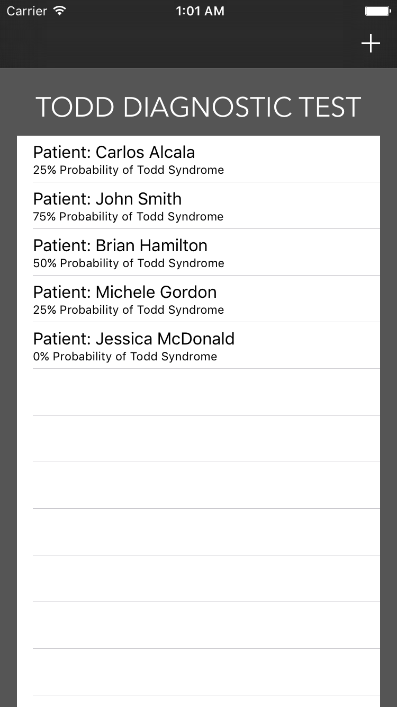
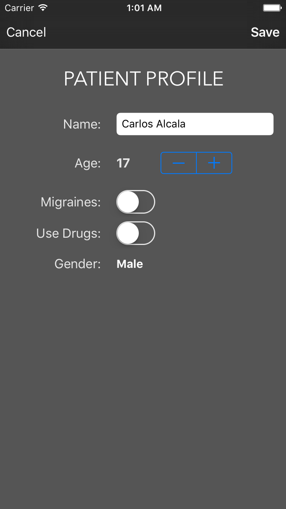
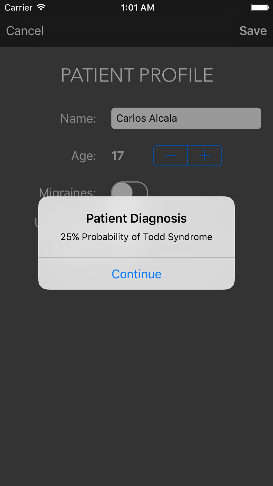

# ToddTest
Alice in Wonderland Syndrome (also known as Todd's syndrome or lilliputian hallucinations) Diagnostic Test App https://en.wikipedia.org/wiki/Alice_in_Wonderland_syndrome

## Features

* Swift 2+
* Supports CoreData, AutoLayout and Size Classes
* Supports from iPhone 4s to 6s+
* Easy to use
* REST-API Manager ready for Alamofire Library implementation

## Usage

### Home

1. See the current list of Patients
2. Use the "+" button to Add New Patients
3. Select Any Patient on the List to Edit Profile
4. Swipe to Delete on Any Patient Cell

### Patient

1. Use the "Cancel" button to go back to the List
2. Use the "Save" button to save/update the current Patient
3. When Saved you will see the Diagnostic
4. Swipe to Delete on Any Patient Cell

## Screenshots

### Home

### Patient

### Diagnostic

## License

`ToddTest` is available under the MIT license. See the LICENSE file for more info.
